# PhysCoRe 官方代码仓库结构与核心机制讲解

> 分析基线：官方仓库提交 `ba7ddf7`（initial open-source release，2026-09-13）与 [PhysCoRe 论文 v2](https://arxiv.org/html/2607.20653v2)。对比参考：[PhysTwin](https://arxiv.org/abs/2503.17973)。本文解释的是**当前开源代码实际会做什么**，不把论文中的系统愿景自动等同于已发布功能。

## 1. 一句话理解代码

PhysCoRe 的主链路是：先把多视角 RGB-D 视频离线转成具有稳定粒子身份的 3D 轨迹；MfM（Material from Motion）从运动窗口一次性估计每粒子的材料参数与置信度，MLS-MPM 据此执行可微物理 rollout，RfD（Residual from Discrepancy）再周期性修正 MPM 网格速度，以吸收真实世界与理想模拟器之间无法被材料参数解释的残差。

换句话说，**MfM 回答“这个物体应该怎样变形”，RfD 回答“即便材料估对了，当前模拟还漏掉了什么”**；二者都不替代 MPM，而是分别给 MPM 提供参数和状态更新残差。

```mermaid
flowchart LR
    A[多视角 RGB-D 视频<br/>V × T × H × W] --> B[GroundingDINO + SAM2<br/>前景 mask]
    B --> C[CoTracker<br/>跨帧 2D 对应]
    C --> D[深度反投影 + 多视角融合<br/>观测点 P_t × 3]
    D --> E[DPSR + 体素填充 + KNN 传播<br/>episode_data.pt]
    E --> F[粒子轨迹 x_obs<br/>T × N × 3]

    F --> G[MfM 特征窗口<br/>B × N × 10 × 128]
    G --> H[窗口拼接<br/>B × N × 1280]
    H --> I[Graph U-Net + 时序 Conv/GRU]
    I --> J[每粒子材料<br/>B × N × 2: logE, nu]
    I --> K[每粒子置信度<br/>B × N × 2]

    J --> L[MLS-MPM 状态<br/>x,v: B×N×3<br/>F,C: B×N×3×3]
    L --> M[P2G: 27 邻点 B-spline<br/>grid v,m: B×G³×3/1]
    K --> N[RfD 活跃网格特征<br/>M × 19]
    M --> N
    N --> O[Sparse U-Net + FiLM<br/>Δv_grid: M × 3]
    O --> P[grid v ← grid v + Δv<br/>默认每 10 个 MPM substep]
    P --> Q[G2P + F/x 更新 + 塑性映射]
    Q --> L
    Q --> R[未来粒子轨迹 / 点云 / 视频]

    S[控制器轨迹与接触] --> G
    S --> M
    S --> N
```



图中 `B` 是 batch，`N` 是粒子数，`G=32` 是默认网格边长，`M` 是当前有质量的稀疏网格数量。最容易误解的一点是：MfM 不直接吃 RGB；RGB-D 已在离线阶段被压成粒子轨迹和控制信号。

## 2. 核心目录与子系统总览

```text
PhysCoRe/
├── train_MfM.py / validate_MfM.py       # 材料推断训练与评估入口
├── train_RfD.py / validate_RfD.py       # 残差动力学训练与未来预测入口
├── render_MfM_confidence_3dgs.py        # 将 MfM 置信度映射到已有 3DGS
├── configs/
│   ├── train_MfM.yaml / validate_MfM.yaml
│   ├── train_RfD.yaml / validate_RfD.yaml
│   └── augment_recipe.yaml               # 多材料合成增强配方
├── datagen/
│   ├── process2d/                        # 分割、跟踪、深度点云、多视角处理
│   ├── convert3d/convert_to_episode.py   # 表面重建、内部填粒子、episode 序列化
│   └── augment/run_recipe.py             # 调用 MPM 生成材料增强 episode
├── physcore/
│   ├── model_MfM.py                      # MfM：图空间编码 + 窗口/时序编码 + 解码头
│   ├── model_RfD.py                      # RfD：19 维活跃网格特征 + 稀疏 3D U-Net
│   ├── particle_flow/
│   │   ├── dataset.py / episode_runtime.py
│   │   ├── mfm_training.py / mfm_validation.py
│   │   ├── rfd_runtime.py / rfd_engine.py
│   │   ├── rollout.py / rollout_runtime.py
│   │   └── augmentation.py               # 异质材料场采样与重模拟
│   ├── sim/
│   │   ├── mpm.py                        # 高层 MPMSolver 与边界/控制器装配
│   │   ├── rigid_body.py / primitives.py # 碰撞体与接触几何
│   │   └── visualizer.py
│   ├── mpm/mpm_model.py                  # 真正的张量化 MLS-MPM P2G/G2P 内核
│   ├── constitutive/                     # Corotated 弹性与塑性 return mapping
│   └── fixed_material/                   # 固定/逐对象材料优化基线工具
├── gaussian_splatting/                   # 轨迹到高斯可视化的仓库内逻辑
└── cloned-gaussian-splatting/            # 需另行编译的外部 CUDA 扩展目录
```

可按职责分成五层：

| 逻辑子系统 | 输入 | 输出 | 核心职责 |
|---|---|---|---|
| 感知与 episode 构建 | 标定后的多视角 RGB-D | `episode_data.pt` | 把像素观测变为稳定编号的 3D 粒子与控制器轨迹 |
| MfM 材料识别 | 10 帧粒子运动窗口及控制证据 | `logE, ν, confidence` | 用观测运动约束 MPM 的本构参数 |
| MLS-MPM | 粒子状态、材料、边界条件 | 下一 substep 的 `x,v,F,C` | 显式模拟弹塑性、重力、接触和控制器 |
| RfD 模型误差补偿 | MPM 活跃网格的 19 维特征 | 网格速度残差 `Δv` | 学习未建模的动力学与系统误差 |
| 评估与渲染 | rollout 轨迹 | Chamfer/L2、点云/视频/3DGS | 未来预测、消融和结果可视化 |

`physcore/fixed_material/` 不是 MfM/RfD 主链路，而是逐对象寻找固定材料参数的支持性基线；它与 PhysTwin 的“为每个场景做测试时优化”思想相近，但不是 PhysTwin 全套外观—物理孪生实现。

## 3. End-to-End 执行生命周期

仓库没有一个包办所有阶段的 `demo.py`。一条完整生命周期由多个入口拼接而成，最能反映实际运行方式的是 `validate_RfD.py` 的“前半段识别、后半段预测”。

### 3.1 离线数据构建

1. `datagen/process2d/process_data.py` 顺序调度分割、稠密跟踪、点云生成、mask 后处理和轨迹采样。
2. GroundingDINO/SAM2 产生物体 mask，CoTracker 产生跨帧 2D 对应；深度与相机参数将其反投影成多视角 3D 观测。
3. `datagen/convert3d/convert_to_episode.py` 对首帧做 DPSR 表面重建和 marching cubes，再体素化填充内部粒子。首帧之外的粒子轨迹不是逐帧重新重建，而是通过邻近已跟踪点的运动做 KNN 传播。
4. 输出 `episode_data.pt`，关键字段包括：
   - `particle_coords: [T,N,3]`、`velocities: [T,N,3]`；
   - `tracked_particle_indices` 与稳定的粒子顺序；
   - 控制器、接触、刚体信息；
   - 多视角 `observation_data`，包含每帧可见点、mask、粒子对应和相机参数；
   - 初始材料先验。加载时 `F` 重建为单位阵，APIC affine matrix `C` 重建为零。

### 3.2 可选的材料增强与 MfM 训练

1. `datagen/augment/run_recipe.py` 读取 `configs/augment_recipe.yaml`。
2. `physcore/particle_flow/augmentation.py` 在粒子上采样平滑、多尺度、标准化的 `logE/ν` 场，复用真实控制器轨迹，以 MPM 重模拟出不同材料响应，再渲染带噪观测。论文的 1,120 个训练序列对应 14 个源 episode × 每个 80 种材料配置。
3. `train_MfM.py` 构建 `MfMRefiner` 与 episode loader。每 10 帧形成一次 MfM 输入；默认按同源 episode 分组，使 batch 内粒子数量一致。
4. `physcore/particle_flow/mfm_training.py` 对每个窗口构造 `[B,N,10,128]` 特征，监督归一化后的 `logE/ν`，同时训练置信度和 episode 级弹塑性分类头。
5. 优化目标核心是逐轴 Smooth-L1：`confidence × error - 0.2 × log(confidence)`。这里的 confidence 更像大于等于 1 的“精度权重”，不是概率。
6. 产生 MfM checkpoint 与训练指标。训练完的 MfM 在 RfD 阶段被冻结。

### 3.3 一次标准未来预测：`validate_RfD.py`

1. `validate_RfD.py` 读取 episode、MfM checkpoint、RfD checkpoint 和案例级配置；`physcore/particle_flow/rfd_runtime.py` 建立冻结的 MfM，`physcore/particle_flow/rfd_engine.py` 将 RfD hook 接入 MPM。
2. episode 被切成前后两半。前半段是 system identification：每累计 10 个观测帧，MfM 更新一次材料估计；默认还启用 PID/spring correction，把观测粒子向真实位置拉回。这个 correction 是额外的数据同化机制，不属于 MfM 或 RfD。
3. 到中点冻结材料。当前 wrapper 实际保留 `logE/ν` 与 confidence，却丢弃 MfM 的塑性分类输出；塑性模型由案例 YAML 人工选择。
4. 模拟状态从首帧开始 rollout。每个相机帧分成 25 个外层插值步，每步又执行 2 次 MPM，所以默认是 50 个 MPM substep/帧。`dt` 由真实帧间隔除以 50 动态得到；30 FPS 时约为论文中的 `0.000666 s`。
5. 每个 MPM substep 内部按如下顺序运行：
   `本构应力 → P2G → 除质量/重力/阻尼 → 控制器 Dirichlet 速度 → 地面碰撞 → RfD hook → G2P → 更新 x,F → 塑性 return mapping`。
6. RfD 默认每 10 个 substep 触发一次，即每相机帧约 5 次。它只在有质量的网格节点上构造 `[M,19]` 特征，预测 `[M,3]` 的 `Δv`，并避开被控制器强制赋速的节点。
7. 后半段关闭观测 correction，保持 MfM 材料不变，进行真正的开环未来预测；输出粒子轨迹、点云/视频，以及单向 Chamfer、tracked L2 等指标。

### 3.4 RfD 的训练 step

`train_RfD.py` 先让冻结 MfM 看完前半段，得到一个 episode 内固定的材料场；随后 MPM 从首帧重新开始，RfD 在前半段以 5 个相机帧为一个 truncated-BPTT segment 训练。每段 rollout 后计算“GT 深度点到预测粒子”的单向 Chamfer 加 tracked-particle L2，执行一次 optimizer step，然后 detach 状态。它训练的是跨 episode 共享的 residual corrector，不是每个对象一套网络。

## 4. 核心机制拆解（重点）

### 4.1 MfM：把运动证据变成 MPM 可消费的材料参数

#### 输入到底是什么

`physcore/model_MfM.py::build_features()` 的每粒子、每帧输入恰好是 128 维：

| 分量 | 维度 | 代码含义 |
|---|---:|---|
| canonical position Fourier encoding | 24 | `xyz` 的 4 个频带，每轴 `sin/cos` |
| tracked displacement Fourier encoding | 96 | 位移的 16 个频带，每轴 `sin/cos` |
| tracked mask | 1 | 此粒子当前是否有直接观测证据 |
| 聚合控制方向 | 3 | 邻近控制器的加权方向 |
| 聚合控制位移 | 3 | 邻近控制器的加权位移 |
| 控制证据权重 | 1 | 距控制器越近越大 |
| **合计** | **128** | |

控制证据通过 `exp(-distance / 0.04)` 聚合，其中 `0.04` 是代码硬编码。模型函数签名虽接收 `material/velocity/F/correction/mask` 等参数，但当前 `build_features()` 并不使用它们；配置中的若干 `use_*` 开关因此不会改变实际输入。

10 个帧特征先被 `FeatureWindowAggregator` 直接展平为 `[B,N,1280]`，再投影回 `[B,N,128]`。所以论文中的“时序模块”需要更精确地理解：

- 窗口内部 10 帧主要通过拼接 MLP 融合；
- depthwise temporal convolution 和 GRU 处理的是**连续 MfM 更新窗口形成的 token 流**；
- `attention_window=8` 实际是历史 token 缓存长度，没有 self-attention；`attention_heads` 也没有进入计算。

#### 空间与时间怎样结合

`GraphUNetSpatial` 在首帧 canonical positions 上做 KNN。边特征默认只有归一化后的 canonical 距离，消息传递形式是节点投影加边投影再聚合。拓扑被缓存，整个 episode 不随形变更新。这提供了材料场的空间平滑和局部传播，但代价是：

- `torch.cdist` 显式生成 `N×N` 距离矩阵，内存/时间是二次复杂度；
- 大变形后真实邻居改变，图仍停留在 canonical 空间；
- 默认比例 `[1.0,0.5,0.25]` 是逐层在上一层继续抽样，实际节点数约为 `N → N/2 → N/8`，不是容易想象的 `N → N/2 → N/4`。

空间 U-Net 输出再进入 depthwise `Conv1d(kernel=9)` 和后半层的 GRU。最终 decoder 为材料头和塑性头：

```text
material_raw [B,N,4]
  ├─ sigmoid 前两维 → logE∈[5,11], ν∈[0.05,0.45]
  └─ 1 + exp 后两维 → confidence∈[1,+∞)

plasticity_logits [B,N,2]
  └─ 对 N 做 max pooling → episode-level elastic/plastic
```

材料 confidence 两个输出通道被零初始化，因此初始值是 2；塑性头在当前代码里并未同样零初始化，这和论文文字描述不完全一致。

#### MfM 如何辅助 MPM

MfM 输出的不是直接受力或下一帧位置，而是每粒子本构参数：

```text
E_i = exp(logE_i)
μ_i = E_i / (2(1+ν_i))
λ_i = E_i ν_i / ((1+ν_i)(1-2ν_i))
```

Corotated elasticity 用 `λ_i, μ_i` 与形变梯度 `F_i` 计算粒子应力，然后 P2G。这样，不同粒子可拥有不同刚度与泊松比，形成空间非均匀材料。confidence 默认**不会门控或回退材料值**；它的实际主用途是作为 RfD 的两个输入通道，以及单独做可视化。若要启用置信度门控，验证配置必须显式选择相应 policy，默认是 `none`。

### 4.2 MLS-MPM：两个学习模块之间的物理骨架

真正的 MPM 张量内核在 `physcore/mpm/mpm_model.py`，而 `physcore/sim/mpm.py` 负责高层装配。核心状态是：

| 状态 | 形状 | 含义 |
|---|---|---|
| `x, v` | `[B,N,3]` | 粒子位置、速度 |
| `F, C` | `[B,N,3,3]` | 形变梯度、APIC 仿射速度矩阵 |
| `grid_v` | `[B,G³,3]` | 展平网格速度/动量缓冲 |
| `grid_m` | `[B,G³,1]` | 网格质量 |
| `material` | `[B,N,2]` | `logE, ν` |

P2G/G2P 都使用二次 B-spline，每个粒子访问 `3×3×3=27` 个网格节点。MfM 决定应力的材料系数；RfD 则在网格速度已经过物理更新和边界处理后、G2P 之前插入残差。因此职责边界很清楚：

```text
MfM: 观测历史 → constitutive parameter field
MPM: parameter field + current state → physically structured transition
RfD: structured transition → learned grid-velocity correction
```

代码为稳定性加入了明显的数值保险：`F`、Jacobian、stress 被 clamp/`nan_to_num`，粒子位置被限制在网格内部，越界网格索引直接 clamp 到边界。它们提高可运行性，但会改变极端变形下的真实动力学。

### 4.3 RfD：在 MPM 网格上学习“物理解释不了的那一部分”

#### 为什么在网格上修正，而不是直接预测粒子位置

网格是 MPM 汇总局部质量、动量、应力和边界条件的地方。把 residual 放在 P2G 与 G2P 之间，可以复用 MPM 的局部空间结构，并让一个网格 correction 同时影响附近粒子；这比直接改 `x` 更容易保留连续运动和控制器约束。

`build_active_grid_features()` 只选 `grid_m > 1e-15` 的节点，形成 spconv 坐标 `[batch,x,y,z]` 和 19 维特征：

| RfD 特征 | 维度 | 来源 |
|---|---:|---|
| 当前网格速度 | 3 | MPM grid update 后 |
| `log(1 + grid_mass)` | 1 | 活跃网格质量 |
| 对称应力 | 6 | `xx,yy,zz,xy,xz,yz` |
| `logE, ν` | 2 | MfM 输出经 B-spline 聚合 |
| 两轴 confidence | 2 | MfM 输出经 B-spline 聚合 |
| 粒子速度聚合 | 3 | P2G 邻域加权 |
| contact indicator | 1 | 接触粒子的邻域占比 |
| ground distance | 1 | 网格到地面距离 |
| **合计** | **19** | |

这里的 stress 是 RfD 根据 `F/logE/ν` 用 Corotated 公式重新计算的，不是直接复用 MPM 已计算的 stress；如果主模拟器切换到别的弹性模型，RfD 特征仍隐含 Corotated 假设。

#### 网络与注入位置

`GridVelocityCorrector` 是两级稀疏 3D U-Net，默认通道约 `32→64→128`。每个 block 使用 GroupNorm、SiLU，并由 16 维 episode context 做 FiLM 调制。论文将非线性概括为 ReLU，但代码实际是 SiLU。末端 `1×1` sparse convolution 被全零初始化，所以训练开始时严格退化为原始 MPM：

```text
Δv_active = 0.05 × tanh(head(sparse_unet(features, context)))
grid_v[active] += Δv_active
```

默认每 10 个 MPM substep 注入一次。控制器 Dirichlet 区域内的 residual 被置零，避免网络覆盖用户施加的速度。配置中的 `max_delta_velocity_norm` 看似可限制向量范数，但对应函数当前直接返回输入，实际限制来自网络内部逐分量的 `0.05×tanh`。

#### RfD 究竟补什么

它可能吸收材料估计误差、离散化误差、阻尼、轻微接触误差、重建噪声和未建模动力学，但这些误差没有被可辨识地拆开。因此 RfD 的优势是效果，代价是解释性：学到的 `Δv` 不能被可靠解释为某一种物理量。它也无法自动弥补拓扑变化等状态表示本身不支持的现象。

### 4.4 两个模块的分工、耦合与关键缺口

| 问题 | MfM | RfD |
|---|---|---|
| 工作尺度 | 每粒子、每观测窗口 | 活跃 MPM 网格、每若干 substep |
| 修改 MPM 的位置 | 本构参数 `logE/ν` | G2P 前的 `grid_v` |
| 主要输入证据 | 粒子位移、mask、控制器运动 | 当前模拟状态、应力、材料、置信度、接触 |
| 归纳偏置 | 材料场空间平滑、时间记忆 | 稀疏 3D 局部卷积、残差学习 |
| 不确定性用途 | 输出 confidence | 将 confidence 当普通输入通道 |
| 失败时的风险 | 错误材料影响整个 rollout | residual 可能拟合数据集偏差 |

二者是串联而非联合端到端训练：先监督训练 MfM，再冻结 MfM 训练 RfD。RfD 的梯度不会反向改善 MfM，材料识别和 residual 之间也没有显式可辨识约束。更关键的是，MfM 虽训练了 elastic/plastic 分类头，当前 RfD runtime 却不消费这一输出；实际塑性类型由案例配置人工给定。

## 5. 理论 vs 代码映射表

| 论文核心创新点/概念 | 具体代码位置与工程实情 |
|---|---|
| 从运动推断空间变化的材料参数 MfM | `physcore/model_MfM.py::MfMRefiner`、`decode()`；输出逐粒子 `logE/ν`。范围用 sigmoid 硬限制为 `[5,11]`、`[0.05,0.45]`，只能在训练定义的材料族内插值。 |
| Motion / control evidence encoding | `physcore/model_MfM.py::MfMRefiner.build_features()` 与 `physcore/particle_flow/mfm_training.py` 的 observation 构造；输入不是视频，而是预处理后的持久粒子轨迹。若 tracking/深度错，网络没有图像分支可自行纠正。 |
| Spatial graph U-Net | `physcore/model_MfM.py::GraphUNetSpatial`；canonical KNN 图、全量 `torch.cdist`，拓扑固定。配置 `layers` 不控制实际层数，层数由 level 数派生。 |
| Temporal convolution + GRU | `physcore/model_MfM.py::Temporal`；确有 depthwise conv 和 GRU，但 10 帧原始窗口先被展平，时序网络处理的是窗口 token 历史。所谓 `attention_window` 只是缓存长度，并无 attention。 |
| Evidence-aware confidence | `physcore/model_MfM.py::MfMRefiner.decode()` 与 `physcore/particle_flow/mfm_training.py` 的异方差式 loss；输出为 `1+exp(raw)`，是无上界 precision-like 权重，不是校准概率。默认不用于材料回退，只进入 RfD/渲染。 |
| Elastic/plastic regime classification | `plasticity_head` 与 `episode_is_elastic`；标签从父目录名是否含 `_elastic` 推导，脆弱；训练得到的预测在 RfD runtime 被丢弃，实际塑性由 YAML 指定。属于实现缩水。 |
| Material augmentation / heterogeneous fields | `datagen/augment/run_recipe.py`、`physcore/particle_flow/augmentation.py`；平滑噪声生成异质材料并用 MPM 重模拟。论文 1,120 episodes 的生成管线已给出，但仓库不附数据。 |
| Differentiable MLS-MPM | `physcore/mpm/mpm_model.py::MPMModel.p2g2p` 与 `physcore/sim/mpm.py::MPMSolver`；27 邻点二次 B-spline、APIC、Corotated/塑性映射。大量 clamp 是工程稳定性妥协。 |
| Residual from Discrepancy | `physcore/model_RfD.py::GridVelocityCorrector`、`build_active_grid_features()`；19 维活跃网格特征，spconv U-Net 预测速度残差。头部零初始化，保证初始等价于 MPM。 |
| Episode-conditioned FiLM | `physcore/model_RfD.py` 中 context encoder / FiLM blocks；16 维 context 存在，归一化与激活具体采用 GroupNorm + SiLU。 |
| 周期性 residual injection | `physcore/particle_flow/rfd_engine.py::GVCRolloutEngine`；通过 monkey-patch/stash MPM 状态并注册 grid hook，默认每 10 substep 触发。类名仍保留早期 `GVC` 命名。 |
| 控制器与接触感知 | MPM controller boundary、RfD contact feature；控制器区域会 mask residual。但真实接触 ID 只有在粒子行身份稳定率至少 95% 时保留，否则 contact 特征可能全零。 |
| 前半段识别、后半段未来预测 | `validate_RfD.py::_run_validation()`；中点冻结材料，后半段开环评估。前半段默认还有 observation correction，因此不是纯 MPM+MfM rollout。 |
| 真实数据上的 RfD 学习 | `train_RfD.py::_rollout_and_train()`；单向 Chamfer + tracked L2，5 帧 truncated BPTT。训练 loss 的 tracked L2 与验证时 observation-space 匹配版本并不完全一致。 |
| 置信度驱动主动探索 | 论文描述策略愿景；仓库只有置信度输出和 `render_MfM_confidence_3dgs.py`，未发现探索动作选择/机器人闭环实现。未开源。 |
| Goal-conditioned planning / manipulation | 论文展示下游规划价值；当前仓库没有目标优化器、规划器或机器人控制主链。未开源。 |
| 3DGS 可视化 | `render_MfM_confidence_3dgs.py` 与 `gaussian_splatting/`；只对外部已有 Gaussian 模型做 KNN 轨迹变形和着色，不负责训练 3DGS。 |
| 相比 PhysTwin 避免逐对象测试时优化 | MfM 是 amortized feed-forward inference，符合论文主张；`fixed_material/` 仍提供逐对象参数优化基线。仓库不是 PhysTwin 的完整复刻，不能把两者目录逐项等同。 |

## 6. 工程现实与边界（避坑指南）

### 6.1 隐藏 assumption 与硬编码

1. **输入必须预对齐且时间同步。** 相机内外参、深度尺度、多视角帧时间、物体 mask 和 CoTracker 身份都默认可信；MfM 没有图像端到端纠错能力。
2. **粒子身份必须跨帧稳定。** 后续 KNN warp、tracked loss 和 controller/contact 映射都依赖首帧编号。粒子排列还隐含“tracked/surface 在前、interior 在后”的构建逻辑。
3. **batch 内需要相同 `N`。** 默认按源 episode 分组规避变长粒子集；随意混 batch 会在 stack 或图网络处失败。
4. **规范化空间近似单位立方体且 z 轴向上。** 数据加载将物体移到约 `[0.5,0.5,0.2]` 附近；地面、重力、边界和控制器半径都以此尺度解释。
5. **默认 `G=32`。** 更换网格分辨率不仅改变显存，还会改变粒子体积、接触半径和 RfD 分布，不能只当性能旋钮。
6. **控制权重半径存在双重来源。** MfM 特征聚合硬编码 `0.04`，而模拟器/controller evidence 另有案例级 radius；改 YAML 不会同步改变前者。
7. **材料与塑性范围是封闭的。** `logE/ν` 输出区间固定；默认屈服应力等塑性参数也有固定值，超出训练材料族时模型不会外推成新物理。
8. **弹塑性标签依赖文件夹命名。** 父目录名带 `_elastic` 才视为弹性，否则可能被当成塑性。
9. **RfD hook 偏向 batched solver。** 当前 engine 在 batched solver 构造路径上注入状态缓存；绕开标准入口使用 unbatched solver 时，RfD hook 有失效风险。
10. **接触通道可能静默消失。** 粒子行匹配稳定率不足 95% 时真实 contact IDs 不被采用，RfD 看到的 contact feature 可能为零。
11. **粒子体积值得复核。** `MPMSolver` 以半包围盒尺寸计算 `prod(size)/N`，相对完整 AABB 体积可能少一个 8 倍因子；这可能是尺度约定，也可能是遗留近似，迁移数据时不应盲信。

### 6.2 看起来可配、实际无效或默认隐藏的开关

- MfM 配置中的 `use_material/use_velocity/use_F/use_correction`、`attention_heads`、`layers` 等没有进入当前有效计算图。
- `max_controls` 在主训练调用强制聚合控制器后基本不发挥预期作用。
- rollout 的 `max_delta_velocity_norm` 对应 clamp 函数当前被禁用；`apply_force_every_substep`、`max_force_norm` 只残留在注释掉的旧实现中。
- `use_episode_sim_dt` 在当前活跃 RfD rollout 路径没有决定时间步；实际 `dt` 由 camera frame interval 和 50 substeps 推出。
- MfM confidence 默认 policy 是 `none`，不会自动回退到材料先验。
- RfD 验证默认前半段 correction 打开；若要看“纯识别 + 纯物理”的真实性能，应显式使用 `--correction-mode none` 做消融。
- 配置里的 `<group>`、`<train_range>`、timestamp/checkpoint 等是占位符，不替换就不是可直接复现的配置。

### 6.3 宽泛异常捕获与静默失败

- `datagen/process2d/data_process/data_process_track.py` 存在 bare `except`，任何索引、dtype 或逻辑异常都可能被解释成“点在图像外”，从而悄悄丢轨迹。
- `datagen/augment/run_recipe.py` 对单任务使用宽泛 `except Exception`，失败只记作 `AUG-FAIL` 后继续批处理；应检查日志而不是只看进程退出码。
- episode 可视化与 `physcore/sim/visualizer.py` 有宽泛 fallback；编码器/依赖问题可能被降级为无视频或 GIF，而主程序仍继续。

### 6.4 论文有、当前代码没有或没有默认启用

- 没有置信度驱动的主动探索 policy、动作评分器或机器人执行闭环。
- 没有 goal-conditioned planning 主链。
- 没有一键从原始视频到最终预测的统一 demo；多个入口和外部依赖需手工串联。
- MfM 的塑性预测没有接入 RfD/MPM runtime，案例塑性模型靠 YAML 手工指定。
- 不支持撕裂、切割、黏附、流体和拓扑变化；这是状态表示边界，不是多训练几个 epoch 就能解决。
- 当前 checkout 不含论文数据、增强数据、checkpoint 或输出；也未见自动化 tests/CI。
- `requirements.txt` 不能完整建立环境：PyTorch、PyTorch3D、spconv、Grounded-SAM/CoTracker 及 Gaussian CUDA 扩展需要按 README 和本机 CUDA 架构单独安装。

### 6.5 评估解释上的坑

- 默认 `train_RfD.yaml` 与 `validate_RfD.yaml` 的 roots 是相同占位形式；官方默认范式主要做同一 episode 的时间切分，不等价于跨对象独立测试集泛化。
- RfD 训练用 GT 粒子索引的 tracked L2，验证使用观测空间匹配版本，数值不可机械对齐。
- 最后不足一个完整窗口的尾帧可能不进入同样的窗口评估流程。
- RfD 能“修正”并不证明 MfM 材料估计正确；材料误差和模型残差之间存在不可辨识性，必须结合材料监督/消融判断。

## 7. 针对性阅读指南

### 只想懂核心算法

按以下顺序即可，先不要钻数据预处理：

1. `physcore/model_MfM.py`：重点看 `MfMRefiner.build_features()`、`GraphUNetSpatial`、`Temporal`、`decode()`。
2. `physcore/mpm/mpm_model.py`：看 `p2g2p()` 中 stress、P2G、grid update、G2P 的顺序。
3. `physcore/model_RfD.py`：看 `build_active_grid_features()` 和 `GridVelocityCorrector.forward()`。
4. `physcore/particle_flow/rfd_engine.py`：确认 RfD 究竟插在 MPM 的哪一步、多久触发一次。
5. `validate_RfD.py::_run_validation()`：理解“前半段识别、后半段预测”的实验协议。

最小心智模型是：`运动窗口 → 材料场 → MPM transition → 网格残差 → 下一粒子状态`。

### 想复现或修改训练流程

1. 先读 `configs/train_MfM.yaml`、`configs/train_RfD.yaml`，逐项替换路径占位符。
2. 数据格式看 `datagen/convert3d/convert_to_episode.py` 与 `physcore/particle_flow/dataset.py`。
3. MfM loss、窗口和 TBPTT 看 `physcore/particle_flow/mfm_training.py`；训练入口只是装配。
4. RfD rollout/loss/detach 边界看根目录 `train_RfD.py`，hook 看 `physcore/particle_flow/rfd_engine.py`。
5. 材料增强看 `configs/augment_recipe.yaml` 与 `physcore/particle_flow/augmentation.py`。
6. 修改 loss 或时间调度后，同步核对 `physcore/particle_flow/mfm_validation.py` 和根目录 `validate_RfD.py`，避免训练与验证定义漂移。

优先做三组消融：MPM only、MfM+MPM、MfM+MPM+RfD；再分别关闭前半段 correction 和 confidence 输入，才能分清收益来自哪里。

### 想集成组件到自己的系统

- **只接 MfM：** 复用 `physcore/model_MfM.py` 和 `physcore/particle_flow/rfd_runtime.py::FrozenRefiner`，但必须提供稳定编号、同尺度的 `[T,N,3]` 粒子轨迹与控制器证据。
- **只接 MPM：** 从 `physcore/sim/mpm.py::MPMSolver` 进入，统一坐标尺度、粒子体积、`dt`、重力方向和 controller boundary。
- **只接 RfD：** 复用 `physcore/model_RfD.py`，并在自己的 MPM 中提供网格质量/速度、粒子 `x/v/F`、材料、confidence、接触和地面；注入点应保持在边界更新后、G2P 前。
- **接可视化：** `render_MfM_confidence_3dgs.py` 假设已有外部 Gaussian checkpoint；它不是训练 renderer 的入口。

集成前先写一个 shape/scale contract 测试，至少校验 `N`、坐标范围、frame interval、grid size、粒子身份和材料单位；这个仓库当前没有测试套件替你兜底。

## 8. 组会汇报速记与 Quick Start

### 组会汇报速记

> PhysCoRe 的工程核心不是让神经网络替代物理，而是在 MLS-MPM 两端各加一个受约束的学习模块。MfM 把 10 帧粒子运动和控制证据编码成逐粒子的 `logE/ν` 与置信度，给本构模型提供空间非均匀材料；RfD 则读取 MPM 活跃网格上的速度、质量、应力、材料、置信度和接触等 19 维特征，每 10 个 substep 预测一次有界速度残差。前者解决 system identification，后者吸收 simulator discrepancy。代码的真实边界是：输入依赖重型离线 3D tracking，MfM 的塑性分类没有接入 runtime，默认评估前半段还有观测 correction，主动探索和规划也没有开源。因此正确的结论应是“一个带 learned parameter field 与 learned residual 的 MPM 预测框架”，而不是端到端视频物理世界模型。

若对比 PhysTwin，可以补一句：PhysTwin 倾向于为单个对象做测试时的物理孪生优化；PhysCoRe 用 MfM 把材料识别摊销为前向推理，再用一个跨 episode 共享的 RfD 补偿模型偏差。速度优势来自摊销推断，但泛化受训练材料族、轨迹质量和坐标尺度约束。

### 极简命令速查表

下面只列主链路；CUDA/PyTorch/PyTorch3D/spconv、Grounded-SAM2、CoTracker 和 Gaussian 扩展需先按官方 `README.md` 安装。当前仓库不附数据与 checkpoint，因此先把数据放入约定目录，并复制配置后替换所有 `<...>` 占位符。

```bash
# 1) 基础 Python 依赖（不能替代 CUDA 相关手工安装）
pip install -r requirements.txt

# 2) 原始多视角数据预处理；实际参数以脚本 --help 和数据布局为准
python datagen/process2d/process_data.py --help
python datagen/convert3d/convert_to_episode.py --help

# 3) 先检查材料增强 recipe，不直接启动大批量模拟
python datagen/augment/run_recipe.py --config configs/augment_recipe.yaml --dry-run

# 4) 训练/验证 MfM
python train_MfM.py --config configs/train_MfM.yaml
python validate_MfM.py --config configs/validate_MfM.yaml

# 5) 冻结 MfM 后训练/验证 RfD
python train_RfD.py --config configs/train_RfD.yaml
python validate_RfD.py --config configs/validate_RfD.yaml

# 6) 两个关键消融：关闭 RfD；关闭前半段观测校正
python validate_RfD.py --config configs/validate_RfD.yaml --deactivate-gvc
python validate_RfD.py --config configs/validate_RfD.yaml --correction-mode none

# 7) 置信度 3DGS 可视化（需要已有 GS checkpoint 和 MfM 轨迹）
python render_MfM_confidence_3dgs.py --help
```

建议第一次跑通时不要从原始视频开始：先取一个已转换的 `episode_data.pt`，用官方 checkpoint 走 `validate_MfM.py → validate_RfD.py`，确认坐标、CUDA 扩展和 spconv 正常，再回头处理数据或生成 1,120 个增强 episode。排错时始终保存三份输出：MPM only、MfM+MPM、MfM+MPM+RfD；否则很难判断误差来自感知、材料识别、物理离散还是 residual 网络。

------
## todo next

1. 消融
* 注意不同材料点数和厚度不一样！

2. 多种操作 → 泛化

3. VLM估计E和v / 对称性 
* 3D process 有问题，occlusion 会导致建模不准

4. 加一点FEM？